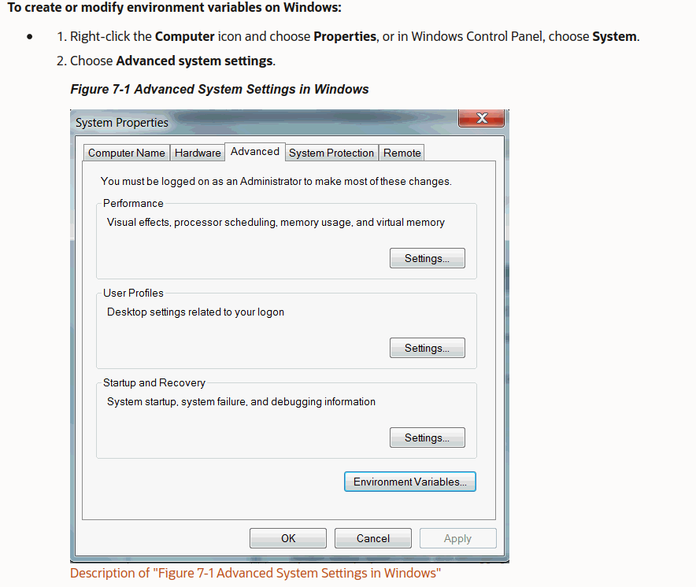
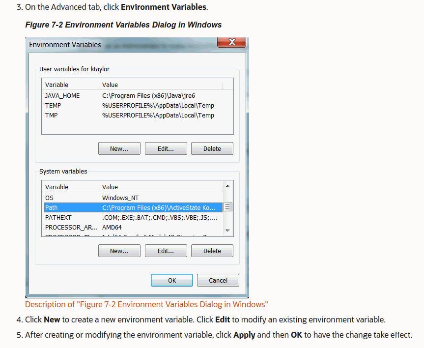

# Music-recommendation-system
Music recommendation system using Spotify API and login interface backend

# Add SECRET_KEY as Environment Variable

 ## Linux 
    `export SECRET_KEY='<your_secret_key>'`

 ## Windows
    
 

 

 For more info regarding setting up Environment Variables in Windows, go through [this link](https://www.youtube.com/watch?v=IolxqkL7cD8).

# Install the package dependencies
While in the root directory of the project, run the following command:
   `pip3 install -r requirements.txt`

# Demonstration
You can find a short demo of the finished project in [this link](https://www.youtube.com/watch?v=Qz5_B1TEcpA&t=12s)

# Setup Guide
Here is a link to [setup the project](https://drive.google.com/file/d/1r15ssGM-lUMU6S_dsrHtE85oNayaonjb/view?usp=sharing).
